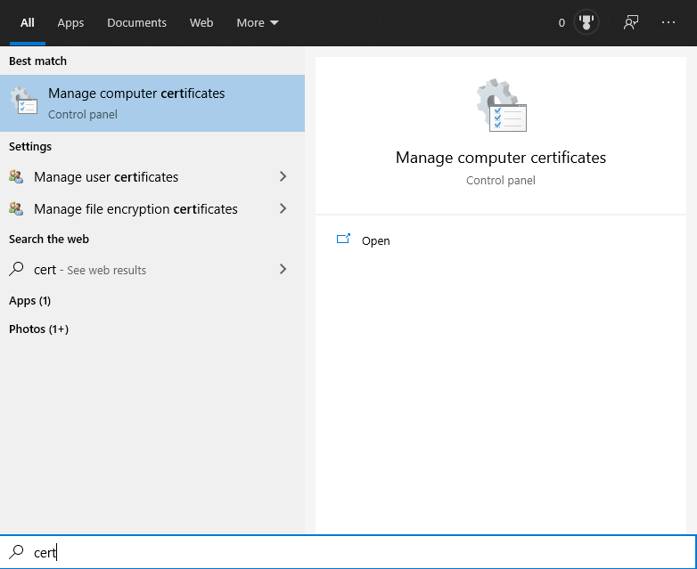
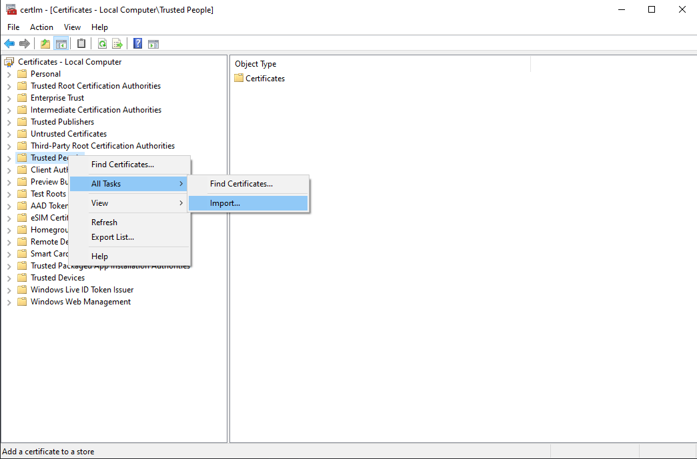

# Hello world for **MSIX**

This is a hello world project demonstrating how to pack a CPP program to a windows **MSIX** package.

The project is highly inspired by [offical document on creating package from source](https://docs.microsoft.com/en-us/windows/msix/package/manual-packaging-root).

## :white_check_mark: What this project do

* build a small console program using CPP
* pack it to **MSIX** installer
* install it on the local machine

## :x: What this project not do

* distribute the app to **Microsoft Store**

## :wrench: Tools used

* MSVC compiler and Windows SDK.
* CMake
* VScode

:bulb: no visual studio needed

## Enable **Develop mode** on your windows 10

```no
Settings -> Update& security -> For developer
```

:bulb: you can check if you have enabled **develop mode** in **PowerShell**:

```powershell
❯ Get-WindowsDeveloperLicense

ExpirationTime        IsValid
--------------        -------
12/31/9999 8:00:00 AM    True
```

## Minimum steps to package you code

1. Build a CPP executable.
2. Create an `appxmanifest.xml` file
3. Fill the required the information in `appxmanifest.xml` file follow the official document
4. Create and import a certificate
5. Pack the runtime files with `makeappx.exe` from windows SDK
6. Sign the app with a certificate

## Create and import a certificate

create a certificate to sign an app

```powershell
New-SelfSignedCertificate -Type Custom -Subject "CN=Tonghao, O=Tonghao, L=Shanghai, S=Shanghai, C=China" -KeyUsage DigitalSignature -FriendlyName "TonghaoCert" -CertStoreLocation "Cert:\CurrentUser\My" -TextExtension @("2.5.29.37={text}1.3.6.1.5.5.7.3.3", "2.5.29.19={text}")
```

:bulb: make sure *CN=Tonghao, O=Tonghao, L=Shanghai, S=Shanghai, C=China* matches the one in [appxmanifest](pack/appxmanifest.xml)

:bulb: replace *TonghaoCert* with what you like

:bulb: see [the official document](https://docs.microsoft.com/en-us/windows/msix/package/create-certificate-package-signing) for details.

### export to a `*.pfx` file

```powershell
$password = ConvertTo-SecureString -String 123 -Force -AsPlainText
Export-PfxCertificate -cert "Cert:\CurrentUser\My\31FD5691A428FD73B26ECEB1E571929BCEF9FFD0" -FilePath d:\oss\hello_msix\tonghao.pfx -Password $password
```

:bulb: modify the *123* and *d:\oss\hello_msix\tonghao.pfx* if needed

### import to TrustedPeople folder




## Sign the app

```powershell
SignTool sign /fd SHA256 hello.msix
```

:bulb: see [the official document](https://docs.microsoft.com/en-us/windows/msix/package/sign-app-package-using-signtool) for details

## How to run this code

* build the executables with CMake
  
  ```cmd
  mkdir build && cd build && cmake ..
  ```

You should now see the installer *hello.msix* in the root directory and install the app by double click the *hello.msxi*

## Install/Uninstall before packing(test only, not requrired by packing)

* Install:

  ```powershell
  Add-AppxPackage -Register AppxManifest.xml
  ```

* Get installed package:

  ```powershell
  ❯ Get-AppxPackage -Name Tonghao.Yuan.hello

  Name              : Tonghao.Yuan.hello
  Publisher         : CN=Tonghao, O=Tonghao, L=Shanghai, S=Shanghai, C=China
  Architecture      : X64
  ResourceId        :
  Version           : 1.0.0.0
  PackageFullName   : Tonghao.Yuan.hello_1.0.0.0_x64__nqywa46cgs0va
  InstallLocation   : C:\Program Files\WindowsApps\Tonghao.Yuan.hello_1.0.0.0_x64__nqywa46cgs0va
  IsFramework       : False
  PackageFamilyName : Tonghao.Yuan.hello_nqywa46cgs0va
  PublisherId       : nqywa46cgs0va
  IsResourcePackage : False
  IsBundle          : False
  IsDevelopmentMode : False
  NonRemovable      : False
  IsPartiallyStaged : False
  SignatureKind     : Developer
  Status            : Ok
  ```

* Uninstall:

  ```powershell
  Remove-AppxPackage -Package "Tonghao.Yuan.hello_nqywa46cgs0va"
  ```

  :bulb: You can also uninstall the app from the **start menu**
